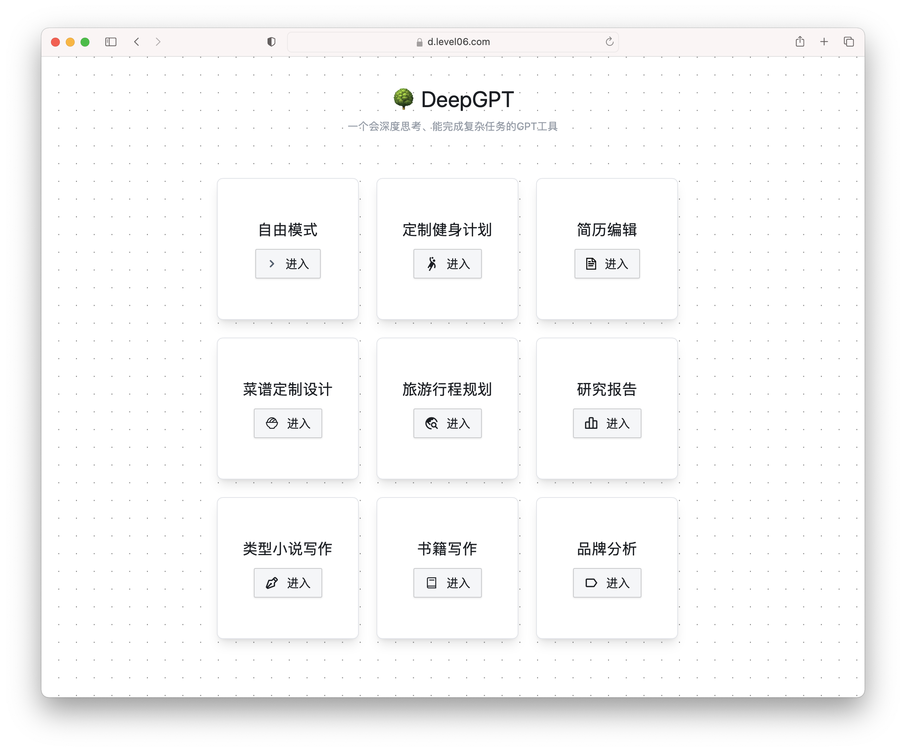
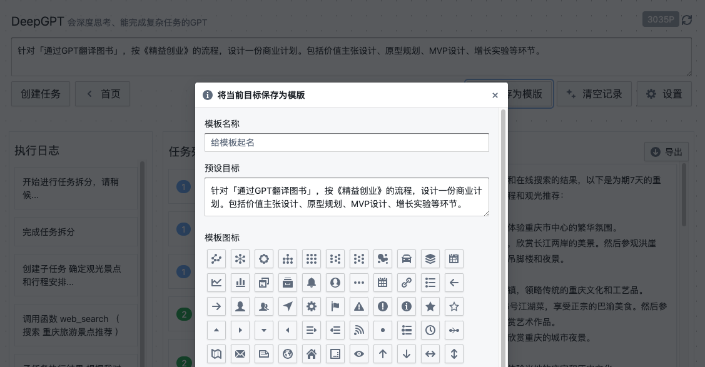
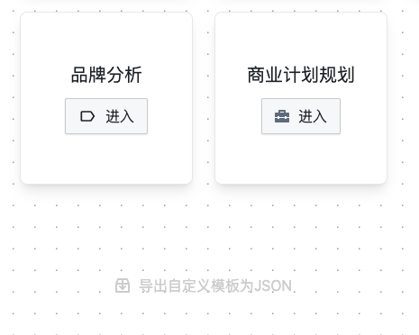
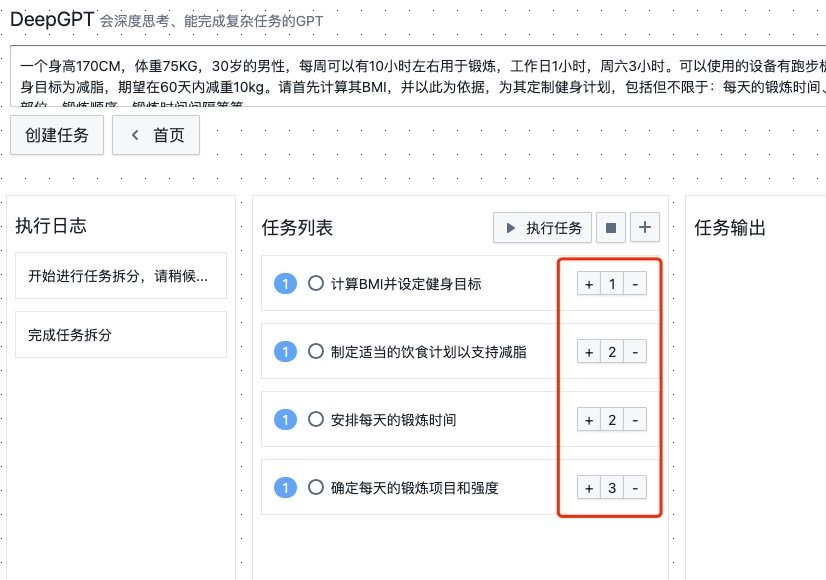
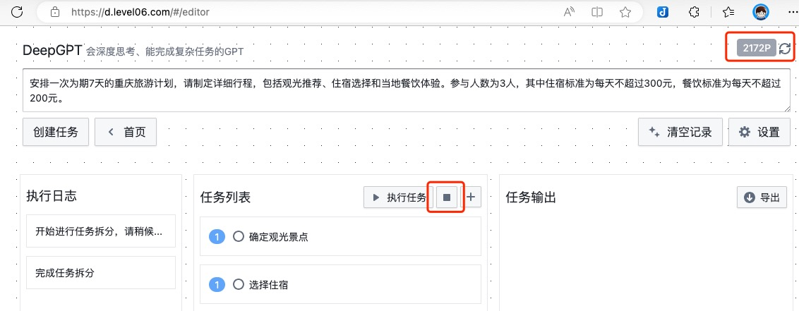

# DeepGPT
类agentGPT/AutoGPT 工具，支持 api2d / 和自定义 openai key。此为静态网页独立部署版，无需后端，一键部署。甚至可以无需服务器，直接部署到对象存储。



1. 官方仓库 <https://github.com/easychen/deepgpt-dist>
1. 在线版本 <https://d.level06.com> (如果无法访问，请到官方仓库查看新域名)
1. 独立部署版下载 <https://github.com/easychen/deepgpt-dist/build.zip>

## 使用教学

请移步B站 <https://www.bilibili.com/video/BV1As4y1k73M>

## Vercel 一键部署

[](https://vercel.com/new/clone?repository-url=https%3A%2F%2Fgithub.com%2Feasychen%2Fdeepgpt-dist.git)


## 独立部署

1. 下载 [Zip包](./build.zip)
1. 解压并部署到服务器，支持静态网页即可

## 更新日志

### 1.0.6 json预设模版支持指定子任务

为了进一步提升对任务的控制力度，支持了预设模版的 `tasks`（子任务） 和 `finalOutput`（最终产出）属性。指定这两个值以后，无需通过「创建任务」按钮生成一级任务，直接点击「执行任务」即可。

通过编辑目录下的 [deepgpt.templates.json](./build/deepgpt.templates.json) 文件，即可为网站添加预设目标模版。以下是一个示例：

```json
[
    {
        "text":"商业计划规划",
        "prompt":"针对「通过GPT翻译图书」的想法，按《精益创业》的流程，设计一份商业计划。",
        "icon":"briefcase",
        "tasks":[
            {
                "content":"根据总目标进行用户细分，返回细分用户的画像",
                "complexity":1
            },
            {
                "content":"根据总目标和用户画像列表，分别提出针对每个用户画像的价值主张，每一个价值主张均包括以下三点 ① 痛点和缓释方案 ② 价值提升点 ③ 产品形态和具体服务",
                "complexity":1
            }
        ],
        "finalOutput":"一份包含了用户画像、价值主张设计、精益画布的商业计划书"
}]
```
其中 `complexity` 是任务复杂度（也就是会被分拆为多少个子任务）；`finalOutput` 是任务的最终产出。

### 1.0.5 支持导出截图

### 1.0.4 支持用户将目标保存为模板，支持通过json预设模版



通过编辑目录下的 [deepgpt.templates.json](./build/deepgpt.templates.json) 文件，为网站添加预设的目标。

该文件也可以**在保存为自定义模板后**，从首页通过「导出自定义模板为JSON」按钮导出。



### 1.0.3 优化任务控制能力，支持手动调整根任务广度，优化只有一个子任务时的汇总逻辑，实时显示消耗点数



### 1.0.2 添加余额显示和任务停止按钮



## Thanks

1. 本项目参考了 [AgentGPT](https://github.com/reworkd/AgentGPT) 的[提示词](https://github.com/reworkd/AgentGPT/blob/main/platform/reworkd_platform/web/api/agent/prompts.py)，故按 GPTv3 协议，开源[本项目的提示词](./prompt.js)
